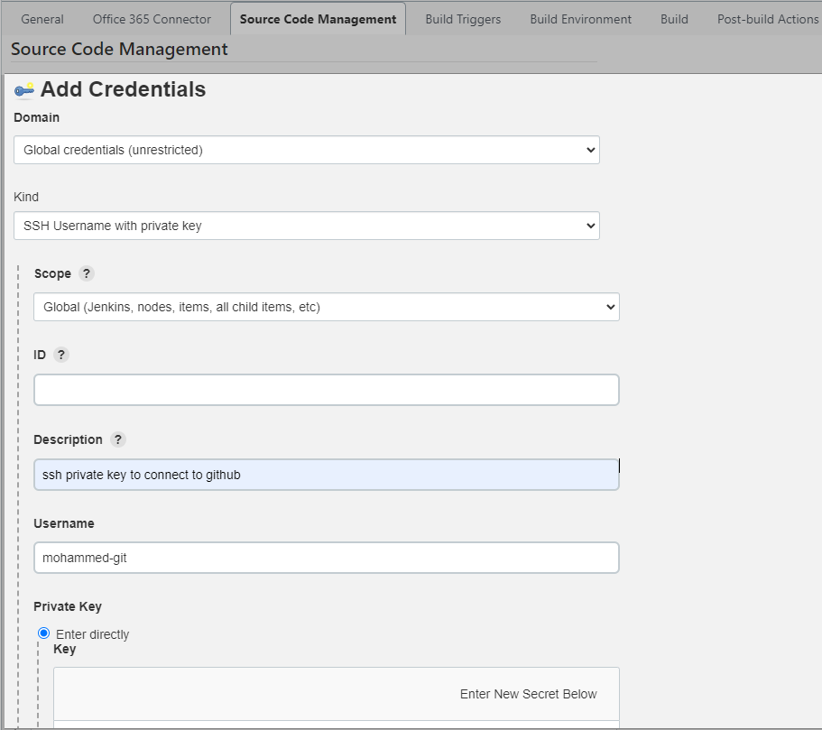

# Calculator test project

The aim of this project is to provide a project where tests can be run and reported in the command line.

# Tests

This is a basic calculator class with two very basic methods.

The tests have been written in both JUnit5 and JGiven.

## Setting JAVA_HOME

You will need to ensure JAVA_HOME is set correctly.

## Gradle & test

Simply running `gradle test` in the command line will run the tests and `gradle test -i` will give more verbose output.

There is no need to install gradle as everything is packaged within this project.

Test output can be found in:

**Build folder**

You will find an HTML report in the folder:

`build/reports/index.html`

you will also find `XML` result output in the folder:

`build/test-results/test/TEST-CalculatorUnitTests.xml`

`build/test-results/test/TEST-CalculatorJgiven.xml`

**JGiven reports**

you will find a JSON report for JGiven output:

`jgiven-reports/TestCalculatorJgiven.json`

# Setting up Jenkins CI
- Select `New Item` from the Jenkins dashboard
- Enter the name of the item and select `Freestyle project`. The name can be something like `Name-CI`
- In your new project page, select `Configure` to set up the CI for you project
### In `General`:
- Enter a description of what you are creating. E.g. 'Creating CI for calculator project'
- Tick the `Discard old builds box` and within it define the `Max # of builds to keep`. 3 is usually a good number for the amount of builds to keep. Too many builds can cause issues and crach the server.
- Tick the `GitHub project` and enter the https link to your project repository in github. E.g. https://github.com/mohammedabidali/calculator_jenkins_pipeline.git/
### skip `Office 365 Connector`
### In `Source Code Management`:
- tick the 'Git' box and it will expand to give you more options
- Under `Repositories` header:
- for `Repository URL` provide the ssh url from GitHub. E.g. git@github.com:mohammedabidali/calculator_jenkins_pipeline.git
- If you have previously created your ssh `credentials` then select it from the drop down menu, otherwise add a new key by clicking the `Add` option, and selecting `Jenkins` from the drop down menu. (only has Jenkins as an option anyway):
1. Within `Jenkins Credentials Provider: Jenkins`, select `SSH Username with private key` for the `Kind`, and add a short description of the key as well as provide a username so that you can distinguish your key.
2. Now paste your private key by ticking the `Enter directly` option under `Private Key` header.
3. Click `Add` to save and add your private ssh key.
- Finally, under the `Credentials` header, select your ssh key from the drop down menu. This key will allow Jenkins to ssh into GiHub automatically.

- Under `Branches to build` header:
- for `Branches Specifier`, add the branch in you want jenkins to merge with the main in GitHub if it passes all the tests. E.g. `*/Dev`
- Leave everything else to default options
### In `Build Triggers`:
- select `GitHub hook triggers for GITScm polling`. Git hooks are scripts that run automatically every time a particular event occurs in a Git repository. Every time we push new code to the Dev branch, jenkins will be trigered to run tests, if they are set up and merge with main if we configure it that way. 
### skip `Build Environment`
### In `Build`:
- Click on `Add build step` and select `Invoke Gradle scrips` from the options
- Tick `Use Gradle Wrapper` and then tick `Make gradlew executable` when it appears.
- Under `Task` type the name of task you want to run a script on. E.g. `test` (which is found within your files when pusing it to Dev branch on GitHub)
### In `Post-build Actions`:
- Click on `Add post-build action` and select `Build other projects` from the options
- Enter the name of the `Project to build`. This option can only be done after you have created a separate project. E.g. `Name-CI-merge`.
- Select `Trigger only if build is stable`. This triggers for the next project to start building only if the build is successfull
- Finally, click `Apply` and then click `Save`
### In `project dashboard`:
- You can click `Build Now` to trigger the build manualy and check if it has been set up correctly.
- Under `Build History` you will see the build in real time. you can click on it to see it working. You can check the logs within the build to see if it has built successfully or if there are any errors that need to be resolved.
# Setting up Webhooks in GitHub:
- Select a project from your current repository
- Select `Settings` from the top bar
- Select `Webhooks` from the side bar
- Click on `Add webhook`
- Under `Payload URL`, type in something like `http://'Jenkins server IP address':8080/github-webhook/`
- Under `Which events would you like to trigger this webhook?` click on `Let me select individual events`
- From those options, make sure to keep `Pushes`, `Pull requests`, and `Active` ticked
- Finally, click on `Add webhook`
# Setting up Jenkins CI-Merge
- The set up of future projects after the first one are very similar.
- Select `New Item` from the Jenkins dashboard
- Enter the name of the item and select `Freestyle project`. E.g. `Name-CI-merge`
- In your new project page, select `Configure` to set up the CI-merge for you project
### In `General`:
- Enter a description of the project. E.g. `Merging Dev branch to main if build is successfull`
- Fill in same details as done in `CI` project above for `General`
### Skip `Office 365 Connector`
### In `Source Code Management`:
- select similar options as done in `CI` project above, but under `Additional Behaviours` click on `Add` and select `Merge before build` from the list
- Under `Name of repository`, type `origin`
- under `Branch to merge to`, type `main`
- Leave all other options as default
### Skip `Build Triggers`
### Skip `Build Environmetn`
### In `Build`:
- follow the same steps as in the `CI` project above
### In `Post-build Actions`:
- Click on `Add post-build action` and select `Build other projects` from the options
- Enter the name of the `Project to build`. This option can only be done after you have created a separate project. E.g. `Name-CD`.
- Select `Trigger only if build is stable`. This triggers for the next project to start building only if the build is successfull
- Click on `Add post-build action` and select `Git Publisher` from the options
- Select the `Merge Results` box and leave everything else as default
- Click on `Add post-build action` and select `Editable Email Notification` from the options
- Under `Project Recipient List`, type in your email that you want to receive an email notification to when bulding the project. Leave everything else as default
- Finally, click `Apply` and then click `Save`
# Setting up Jenkins CD
- Select `New Item` from the Jenkins dashboard
- Enter the name of the item and select `Freestyle project`. E.g. `Name-CD`
- In your new project page, select `Configure` to set up the CD for you project
### In `General`:
- Enter a description of the project. E.g. `Create docker image and upload it to docker hub`
- Fill in same details as done in `CI` project above fro `General`
### Skip `Office 365 Connector`
### In `Source Code Management`:
- Fill in details, similar to `CI` project above, but under `Branch Specifier`, you should type `*/main` instead
### Skip `Build Triggers`
### Skip `Build Environment`
### In `Build`:
- Click on `Add build step` and select `Execute shell` from the options
- Under `Command` enter this command: `sudo docker build . -t 'docker hub username'/'name of project'`. This will build the docker image and make it interactive
- Click on `Add build step` and select `Docker Build and Publish` from the options. This allows you to enter your docker hub credentials, so that you can upload the docker image you create.
- Under `Repository Name`, type `docker hub username'/'name of project'`
- Under `Docker Host URI`, type `unix:///var/run/docker.sock`
- Under `Registry credentials` click `Add` and then select `Jenkins` if you have not previously entered your docker hub credentials.
- Under `Jenkins Credentials Provider: Jenkins`, select `Username and password` as the `Kind` of credentials
- Enter your docker hub credentials under `Username` and `Password`
- Click on `Add` to save docker hub credentials
- Finally, Click `Apply` and then `Save`